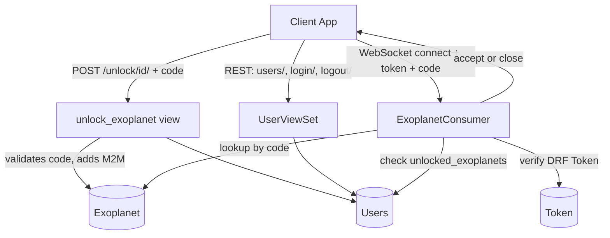

# NovaTech Backend

NovaTech Backend is a Django REST + WebSocket API for a space-exploration game about unlocking exoplanets. Users register and authenticate with a token, redeem unlock codes to add exoplanets to their profile via a REST endpoint, and then connect to a per-exoplanet WebSocket channel (built on Django Channels) that only accepts the connection if that user has already unlocked the corresponding exoplanet.


## Features

- Token-based authentication (Django REST Framework `TokenAuthentication`) with login/logout endpoints
- `UserViewSet` (DRF `ModelViewSet`) for creating and managing player profiles, with open registration (`AllowAny` on create) and authenticated access otherwise
- `Exoplanet` unlock system: `POST /unlock/<id>/` validates a code against the `Exoplanet` model and adds it to the user's `unlocked_exoplanets` (many-to-many)
- Real-time per-exoplanet WebSocket channel (`ws/exoplanet/<code>/`) via Django Channels — the consumer authenticates the connection using a DRF token and rejects it unless the exoplanet has been unlocked by that user
- CORS support for cross-origin frontend clients (`django-cors-headers`)
- Deployable to Vercel (`vercel.json` present) and ASGI servers (Daphne/Uvicorn)

## Tech Stack

- **Language:** Python
- **Framework:** Django 5.1, Django REST Framework
- **Real-time:** Django Channels 4, Daphne (ASGI server), Redis (`channels-redis`) as the channel layer backend
- **Auth:** DRF Token Authentication
- **Database:** SQLite (`db.sqlite3`) for local development
- **Other:** `django-cors-headers`, `Pillow`, `requests`

## Project Structure

- `NovaTech/settings.py` — Django project settings (installed apps, DRF, Channels, CORS config)
- `NovaTech/urls.py` — root URL config, includes `game.urls`
- `NovaTech/asgi.py` — ASGI entry point wiring HTTP + WebSocket routing for Channels
- `game/models.py` — `Exoplanet` and `Users` (profile linked 1:1 to Django `User`, with unlocked exoplanets)
- `game/views.py` — `UserViewSet` and the `unlock_exoplanet` API view
- `game/urls.py` — REST routes: user CRUD (via DRF router), `unlock/<id>/`, `login/`, `logout/`
- `game/consumers.py` — `ExoplanetConsumer`, an `AsyncWebsocketConsumer` that authenticates via token and gates access by unlock status
- `game/routing.py` — WebSocket URL patterns (`ws/exoplanet/<code>/`)
- `game/Serializer.py` — DRF serializer(s) for the `Users` model
- `game/migrations/` — schema history for the `Users` model (renamed fields across several migrations)
- `manage.py` — Django management entry point

## Architecture



## Installation

```bash
git clone https://github.com/OmarElzero/NovaTech_Backend.git
cd NovaTech_Backend
python -m venv venv
source venv/bin/activate
pip install -r requirements.txt
python manage.py migrate
```

A Redis instance is required for the Channels layer in production; for local development Channels can fall back to an in-memory layer depending on `settings.py` configuration.

## Usage

Run the ASGI development server (required for WebSocket support):

```bash
python manage.py runserver
# or, for full ASGI/WebSocket support:
daphne NovaTech.asgi:application
```

Example flow:

```bash
# Register / create a user
POST /users/  {"userName": "...", "email": "...", "password": "..."}

# Unlock an exoplanet with a code
POST /unlock/<user_id>/  {"code": "EXO-001"}

# Connect to the exoplanet's real-time channel
ws://<host>/ws/exoplanet/EXO-001/?token=<drf-token>
```

## Demo

Live demo: [https://nova-tech-backend-debloyment.vercel.app](https://nova-tech-backend-debloyment.vercel.app)

---

**Author:** OmarElzero · [GitHub](https://github.com/OmarElzero)
_Last updated: 2026-08-23_
